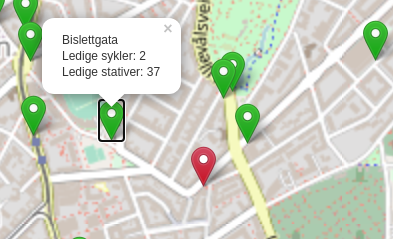

# Technical tasks from Ardoq

This is my answers to the pre interview technical tasks from Ardoq.

## Task 1
Task: Create a function that multiplies the three highest numbers of a list. The task is implemented as a simple Python function.
Run with `python task1.py`.

## Task 2

### First try (`task2-try1`)
I tried to get things up and running with Node.js.
However, I don't really know how Node works, so I failed and gave up.
I really have to learn Node, though, so I'll probably keep working on this task.

### Second try (`task2-try2`)
As it didn't work out with Node, I went with the "old-style" approach without fancy package managers or server side Javascript.

The city bike stations are presented in a map, together with information about the numbers of bicycles at each station.
To see the results, simply clone this project and open the `task2-try2/index.html` in your browser.

Some screenshots of the result is attached below:

